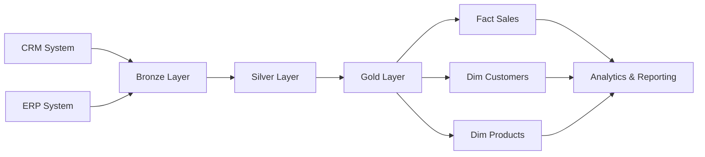
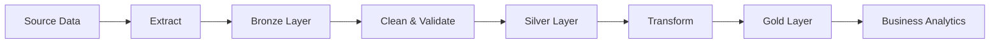

# 🚀 Enterprise Data Warehouse Project  

> End-to-End SQL Server Data Warehouse using Medallion Architecture (Bronze → Silver → Gold) to transform raw CRM and ERP data into analytics-ready business insights.


[](https://datawarehouse-etl-project.netlify.app/)


---

# 📌 Project Overview

This project demonstrates the design and implementation of a modern SQL Data Warehouse following industry-standard Data Engineering practices.

The solution integrates data from multiple source systems, performs cleansing and standardization, and delivers business-ready analytical datasets using a dimensional model.

### Key Highlights

✅ Built a complete Data Warehouse from scratch

✅ Implemented Bronze → Silver → Gold architecture

✅ Designed Fact and Dimension tables

✅ Applied Data Quality Validation

✅ Created ETL pipelines using T-SQL

✅ Developed analytical datasets for reporting

✅ Followed Data Modeling best practices

---

# 🏗️ Solution Architecture



---

# 🎯 Business Problem

Organizations often face:

- Data stored across multiple systems
- Inconsistent customer information
- Duplicate records
- Difficult reporting processes
- Lack of centralized analytics

This project solves these challenges by creating a centralized Data Warehouse that provides a single source of truth for reporting and decision-making.

---

# 📂 Repository Structure

```text
data-warehouse-project
│
├── datasets/
│
├── scripts/
│   ├── bronze/
│   ├── silver/
│   ├── gold/
│
├── tests/
│
├── docs/
│
└── README.md
```

---

# 🏛️ Data Warehouse Architecture

## Bronze Layer

Raw data ingestion from source systems.

**Purpose**

- Preserve source data
- Maintain audit trail
- Minimal transformations

---

## Silver Layer

Data cleansing and standardization.

**Processes**

- Remove duplicates
- Handle null values
- Standardize formats
- Apply validation rules

---

## Gold Layer

Business-ready analytical datasets.

**Outputs**

- Fact Tables
- Dimension Tables
- Aggregated Metrics
- Reporting Views

---

# ⭐ Star Schema Design

```text
                 dim_date
                     |
                     |
                     |
dim_customers ---- fact_sales ---- dim_products
                     |
                     |
                     |
              dim_geography
```

---

# 📊 Core Tables

## Fact Tables

| Table | Description |
|---------|-------------|
| fact_sales | Sales transactions |
| fact_orders | Order-level metrics |

---

## Dimension Tables

| Table | Description |
|---------|-------------|
| dim_customers | Customer information |
| dim_products | Product catalog |
| dim_date | Calendar dimension |
| dim_geography | Location information |

---

# 🔄 ETL Workflow



---

# 💻 SQL Skills Demonstrated

### Data Warehousing

- Star Schema Design
- Fact & Dimension Modeling
- Surrogate Keys
- Slowly Changing Dimensions (SCD)

### SQL Development

- Complex Joins
- CTEs
- Window Functions
- Stored Procedures
- Views
- Aggregations
- Subqueries

### ETL Engineering

- Data Ingestion
- Data Cleansing
- Data Transformation
- Incremental Loading
- Data Validation

### Performance Optimization

- Indexing
- Query Tuning
- Execution Plan Analysis

---

# 📈 Business Insights Enabled

The warehouse enables analysis such as:

### Customer Analytics

- Top Customers
- Customer Segmentation
- Customer Lifetime Value

### Product Analytics

- Best Selling Products
- Category Performance
- Profitability Analysis

### Sales Analytics

- Revenue Trends
- Monthly Growth
- Regional Performance

---

# 🛠️ Technology Stack

| Category | Technology |
|-----------|------------|
| Database | SQL Server |
| Language | T-SQL |
| Architecture | Medallion Architecture |
| Modeling | Star Schema |
| ETL | SQL-Based ETL |
| Version Control | Git & GitHub |

---

# 🎓 What This Project Demonstrates

This project showcases my ability to:

- Design scalable Data Warehouse solutions
- Build production-ready ETL pipelines
- Apply dimensional modeling principles
- Implement data quality frameworks
- Optimize SQL queries
- Create analytics-ready datasets
- Deliver business-focused reporting solutions

---

# 🚀 How to Run

### 1. Create Database

```sql
CREATE DATABASE DataWarehouse;
```

### 2. Create Schemas

```sql
CREATE SCHEMA bronze;
CREATE SCHEMA silver;
CREATE SCHEMA gold;
```

### 3. Load Source Data

Execute Bronze Layer scripts.

### 4. Run Transformations

Execute Silver Layer scripts.

### 5. Build Analytical Layer

Execute Gold Layer scripts.

### 6. Run Business Queries

Execute scripts from the Analytics folder.

---

# 📚 Learning Outcomes

Through this project I gained hands-on experience in:

- Data Warehouse Design
- ETL Development
- SQL Server Development
- Data Modeling
- Query Optimization
- Business Analytics
- Data Quality Management

---

# 👨‍💻 Author

### Mahendra Kumar Ravi

Data Engineer | M.Tech Data Engineering

**Core Skills**

- SQL
- Data Warehousing
- ETL Development
- Data Modeling
- Data Analytics

LinkedIn: https://www.linkedin.com/in/mahendra-kumar-ravi-055b3121b/ 
LeetCode: https://leetcode.com/u/mahi_leet/
---

⭐ If you found this project useful, consider giving it a star.
